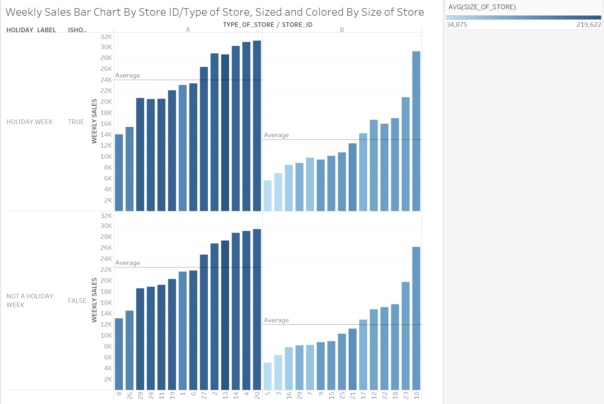

## Session Info

```{r}
sessionInfo()
```

## Finding & Processing Data

### STEP 1: Find a dataset. 

Public datasets are available on sites such as the [United States Census Bureau](http://www.census.gov/), [Reddit](https://www.reddit.com/r/datasets), and [UCI](https://archive.ics.uci.edu/ml/datasets/).

In this case, we a found a set of data that Walmart published for Kaggle, a data science competition site, that includes store information, historic weekly sales, miscillaneous factor that includes sale for 45 stores. The original data set is published [here](https://www.kaggle.com/c/walmart-recruiting-store-sales-forecasting/data).

Unlike the data set we used previously, the data is broken into many files/tables. The three tables that we used for this project are:

+ stores.csv (includes anonymized information about the stores)
+ train.csv (incldues historical training date from 2010-02-05 to 2012-11-01) 
+ features.csv (includes misc. information related to store, department, regional activity for each week)

Here's the description for each column name in the data file.

##### Train.csv

Name of Column | Description
------------- | -------------
Store | the store number
Dept | the department number
Date | the week
Weekly_Sales | sales for the given department in the given store
IsHoliday | whether the week is a special holiday week

```{r}
train_df <- read.csv("../01 Data/train.csv", nrows = 50, stringsAsFactors = FALSE)

```

##### Train.csv

Name of Column | Description
------------- | -------------
Store | the store number
Type | type of store
Size | size of store
```{r}
read.csv("../01 Data/stores.csv", stringsAsFactors = FALSE)
```

##### Features.csv

Name of Column | Description
------------- | -------------
Store | the store number
Date | the week
Temperature | average temperature in the region
Fuel_Price | cost of fuel in the region
MarkDown1-5 | anonymized data related to promotional markdowns that Walmart is running. MarkDown data is only available after Nov 2011, and is not available for all stores all the time. Any missing value is marked with an NA.
CPI | the consumer price index
Unemployment | the unemployment rate
IsHoliday | whether the week is a special holiday week

```{r}
read.csv("../01 Data/stores.csv", nrows=50, stringsAsFactors = FALSE)
```

### STEP 2: Clean up the data Using Extract, Transform, and Load techniques.

The process of ETL is straightforward. We read in the file, figure out what columns are considered dimensions and measured and process numbers as needed.

After running the R_ETL script, we copy & paste the cat(sql) result and run it in SQL Developer to create new tables. One thing to note that some names are not valid as column names in SQL to we changed them. For example, Store is renamed to Store_Id, Date is renamed to Date_of_Week, and so on. In addition, the R_ETL also outputs a reformatted version where the data is cleaned up nicely to meet the standards for importing to SQL database, which we then use to import in the databse. At this stage, it's neccessary to also match the old column names to the new column names we dictated when we first create the empty table.


### STEP 3: Plot Data With Tableau

The SQL query used to gather data from all three tables using inner join in Tableau is a little bit different from the sql query for R.

```
select walmart_train.store_id, 
walmart_train.dept, 
TO_DATE(walmart_train.DATE_OF_WEEK,'YYYY-MM-DD') as real_date,
walmart_train.DATE_OF_WEEK,
walmart_train.isholiday, 
walmart_train.weekly_sales, 
walmart_stores.type_of_store, 
walmart_stores.size_of_store, 
walmart_features.fuel_price,
walmart_features.temperature,
walmart_features.cpi,
walmart_features.unemployment
from walmart_train, walmart_stores, walmart_features
where walmart_train.store_id = walmart_stores.store_id
and walmart_train.store_id = walmart_features.store_id
and walmart_train.DATE_OF_WEEK = TO_CHAR(TO_DATE(walmart_features.DATE_OF_WEEK,'MM/DD/YYYY'), 'YYYY-MM-DD')
```

This way we can have a comprehensive way of viewing the weekly sales data as long as all the other factors that could have affected it.

Also note that in order to not run into any error in Tableau, we have made a another column called **real_date** column where we convert the format of the string to YYYY-MM-DD. If not, we will run into an error where Tableau has a problem transforming and retrieving data with the query.

#### Weekly Sales Bar Chart By Store ID/Type of Store, Sized and Colored By Size of Store



In this visualization, we plotted in the form of bar charts the weekly sales against the Store ID. We also color the bar from smallest store to largest store (light to dark). By doing so, we noticed an interesting correlation where where stores with higher sales are typically bigger, which makes sense. So further solidify this observation, we trellised the plot by the  type of store and plotted the average line for each panel. Thus, we noticed that Type of Store A are probably SuperStore with bigger size and higher sales. On the other hand, Type B is smaller and is probably the normal store.

Interestingly, we can see that the trend is that the larger the store, and the larger the sales. That's what we see in both subplots. However, based on this, we can also see underperforming as well as excellent store. For example, Store 1 is actually averaging 200M weekly sales despite being one of the smaller stores in the type A bunch. Likewise, Store 9 performs worst than Store 7 despite being bigger. We can try to identify what causes this later one using other factors such as Temperature, Fuel Price, etc.

#### Weekly Sales Box Plot by Month and Year, Colored By Type Of Store


In this visualizationn  we graph the weekly sales year and month. We also plotted the average weekly sales for each year. We can see that over the span of 3 years, the average sales mainly stay the same around 18-19K. Howeverr, one interesting thing to notice is the seasonal trend. The sales almost make a curve where it has a small peak during June, decreases, and then returns to the highest peak in November and December.

By coloring the data points by type of store we can also see that the lower range of the sales are from smaller stores (Type B) and higher end of the sales are thanks to larger store (Type A).

Another thing from this plot is that we can see we didn't have any data for January 2010 and November - December 2012 so any correlation we notice from other plots needs to be carefuly considered whether it's because we don't have data or because of some other factors.

#### Weekly Sales In Correlation To Temperature and Fuel Price


This plot tries to find the correlation between sales and temperature and fuel price. It seems that fuel price tends to drive sales more so than tmperature. A fuel price decrease tends to lead to increasinng sales and vice versa. However, as temperature drops in Quarter 4, sales has a much more significant lead. This could be contributed to Black Friday and Holiday sales.

#### Weekly Sales By Department


For this visualization, we plotted the weekly sales, colored by department in the form of area chart. We can see that some departments (e.g. 38, 40, 72 and 95) consistently contribute to the overall sales in large percentange.

We can also see the trend for each department over the years. One thing to note is that it could also lead to erroneous conclusion. For example, department 38 tends to increase in sales toward the final quarter. However, in 2012, it decreases in an almost linear manner. Which we **think** is bad. However, this could be explained due to the lack of data for November and December for 2012. 

#### Treemap of Sales


### Weekly Sales Time Series


As we can tell, during the months of April, July, and October sales are highest, with a huge spike in December. Of course, December is expected due to the holiday season, but this graph gives a better understanding the less obvious sales trends and ultimately can help Walmart in stocking their shelves.


We also utilized the trend-line to predict sales for the coming months in late 2012, for which we do not have data. The result confirms our hypothesis that December sales are much higher than other months.
